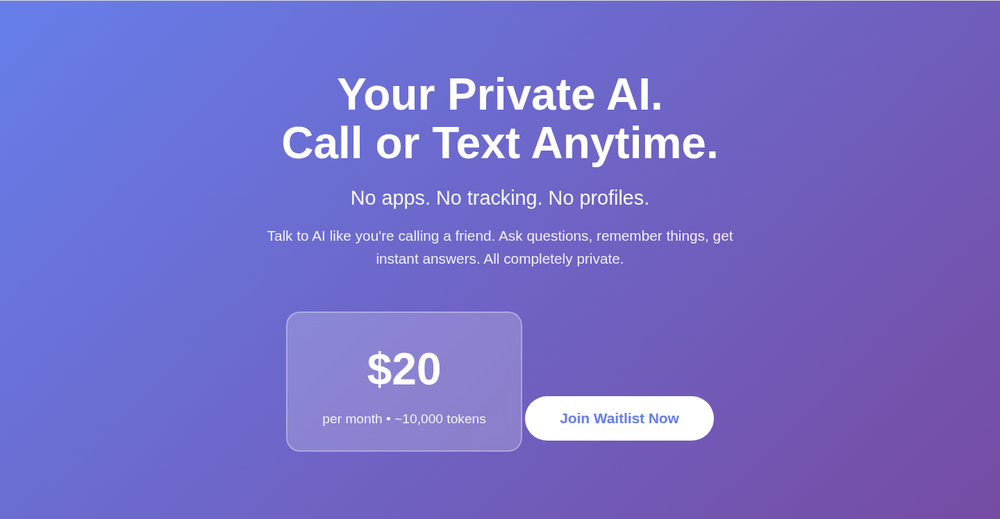

# Ghost AI

> **Status: the Ghost AI marketing site and its backend, from before the
> current Ghost product. Not part of the box.** "Ghost AI" here is a private AI
> you call or text ($20 a month, about 10,000 tokens, waitlist), which is a
> different offering from the Ghost box the rest of these repos build.

In plain terms: a static landing page with a waitlist form, plus a large Express
backend that answers Twilio calls and texts with an AI (voice through the OpenAI
Realtime API), stores the waitlist in Supabase, and also carries the CyberCheck
and Gulf Coast Radar APIs. The backend is not tidy: see "Read this before
using it" below.



*`index.html` served as static files. The capture starts at the hero section, so
the fixed header and the AI logo strip above it (four external image URLs) are
not in it.*

## What is in it

| Path | What it holds |
| --- | --- |
| `index.html` | The Ghost AI landing page: price ($20 a month, about 10,000 tokens), a choice of AI (ChatGPT, Grok, Gemini, Perplexity) and a waitlist form that posts to `https://ghost-ai-production.up.railway.app/api/waitlist/form`. No hero video. |
| `ghost-os-frontend/` | The same folder as a deployable site: `index.html` (identical to the root one), `setup.html` (a token-link page that calls `/api/setup/validate/<token>` and `/api/setup/save/<token>`; those routes are not in `backend-api/`), `simple-ai-call.html` (an older text-to-join variant of the page), `index-backup.html` (the older Ghost OS page with the hero video and feature images), `vercel.json`, `.vercelignore` and `EMAIL-SETUP.md` (describes SendGrid waitlist email from a `server.js` that is not in this repo; `backend-api/src/routes/waitlist.js` sends no email) |
| `hero-video.mp4`, `ghost-os-feature.png`, `how-ghost-os-works.png`, `favicon.svg` | Copies of the media next to the root `index.html`; only `ghost-os-frontend/index-backup.html` refers to the video and the feature image |
| `backend-api/` | A shared Express backend (package name `shared-backend-api`) for Ghost OS, CyberCheck and Gulf Coast Radar: `src/`, `migrations/`, `database/` (`schema.sql`, `platform-connections.sql`, `seeds/example-data.json`), Twilio and Google Sheets scripts, `railway.json`, `vercel.json` |

`ghost-os-platform` holds a related single-file server (waitlist, admin,
integrations, phone and text assistant) and the older Ghost OS page, which is
byte-identical to `ghost-os-frontend/index-backup.html` here. That server imports
files that are not in that repo, so it does not start as committed.

## What the backend does

- **Ghost AI voice and SMS** (`src/routes/ghost-ai.js`, `src/services/realtime-voice.service.js`,
  `src/services/sms-ai.service.js`): a Twilio call webhook at `/api/ghost-ai/voice`
  connects a Media Stream to a WebSocket at `/api/ghost-ai/media-stream`, which
  bridges to the OpenAI Realtime API. There are also Twilio speech-gather fallbacks answered by GPT-4o-mini
  (`/voice-response`, `/voice-process`, `/voice-check`), a call status hook, and
  an SMS webhook at `/api/ghost-ai/sms` (waitlist keywords, otherwise an AI answer).
- **Waitlist** (`src/routes/waitlist.js`): `POST /api/waitlist/form` writes to the
  `ghost_os_waitlist` table.
- **CyberCheck API** (`src/routes/cybercheck/*`, mounted under `/api/cybercheck/`):
  auth, businesses, profiles, menu, contacts, leads, tasks, appointments,
  reviews (with receipt OCR through Google Cloud Vision), loyalty, SMS campaigns
  and automations, phone (Twilio recording, Whisper and GPT), voice notes,
  billing (Stripe), social media (Facebook and Instagram), integration tools,
  a dashboard whose numbers are hard-coded sample values, and an AI route (a customer
  chat and an owner coach). Voice notes and receipts are processed through Bull
  queues, which need Redis.
- **Gulf Coast Radar API** (`src/routes/gcr/*`, mounted at `/api/gcr`,
  `/api/gcr/featured`, `/api/gcr/public`): business listings read from a Google
  Sheet (with a Supabase fallback), featured sections, photo upload, public
  profile, vCard and QR code.
- **Admin and user platform routes** (`/api/admin`, `/api/admin/dashboard`,
  `/api/admin/integrations`, `/api/user/platforms`).
- **Voice CRM by phone** (`src/routes/cybercheck/voice-crm.js`): Twilio webhooks under
  `/api/voice/crm/*`, only registered when `TWILIO_ACCOUNT_SID` starts with `AC`.

Two entry points exist: `src/index.js` (everything above; what `npm start` runs)
and `src/index-ghost-ai-only.js` (waitlist and Ghost AI routes only; what
`railway.json` starts). The Ghost OS demo-queue routes (`src/routes/ghost-os/demo.js`)
are written but commented out in `src/index.js`.

## Run it

Static site: serve the folder (`python3 -m http.server`).

Backend:

```bash
cd backend-api
npm install
npm start          # node src/index.js
npm run dev        # nodemon
npm test           # node --test
```

`npm test` is not a test suite: there are no test files. The only test-named file
is `test-gcr-sync.js`, a manual script that reads the Google Sheet.

See `backend-api/GHOST-AI-SETUP.md` for its settings.

## Read this before using it

- `backend-api/README.md` is out of date. It says to copy `.env.example`
  (there is none) and describes a `routes/shared/` folder (not present).
- `backend-api/.env` is committed, together with `backend-api/node_modules/`
  (13,205 files) and `backend-api/logs/`, even though `.gitignore` lists them.
  The `.env` holds live-looking keys for OpenAI, Twilio, Supabase and others.
  Treat them as leaked and rotate them; do not reuse this repo's history as is.
- The `cybercheck` routes `automations`, `tools` and `dashboard`, and the
  `/api/admin/dashboard` and `/api/admin/integrations` routes, have no login check;
  the first three take a user id from the URL or body. The admin login compares
  against a hard-coded default password.
- The SMS route imports a waitlist handler from an absolute path on one laptop
  (`/Users/owner/CLEAN-PLATFORM-BUILD/...`), and `sms-ai.service.js` uses an
  `aiProvider` variable it never defines, so the text-message AI path does not
  work as written.
- Prices disagree: the site says $20 a month; the disabled demo route speaks
  $49, $50 and $99; `stripe.service.js` lists plans at $0, $29, $99 and $299.
